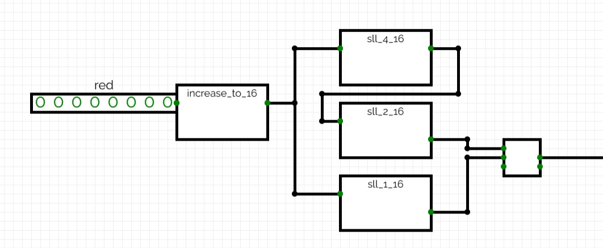
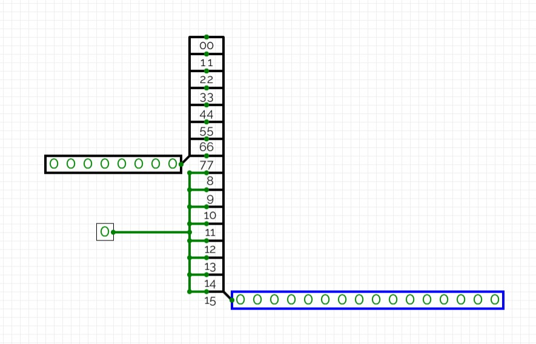
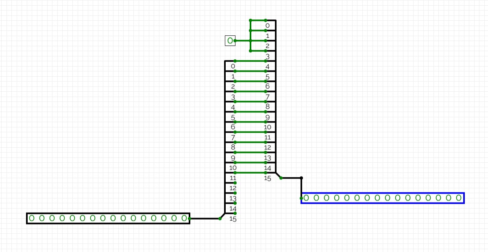
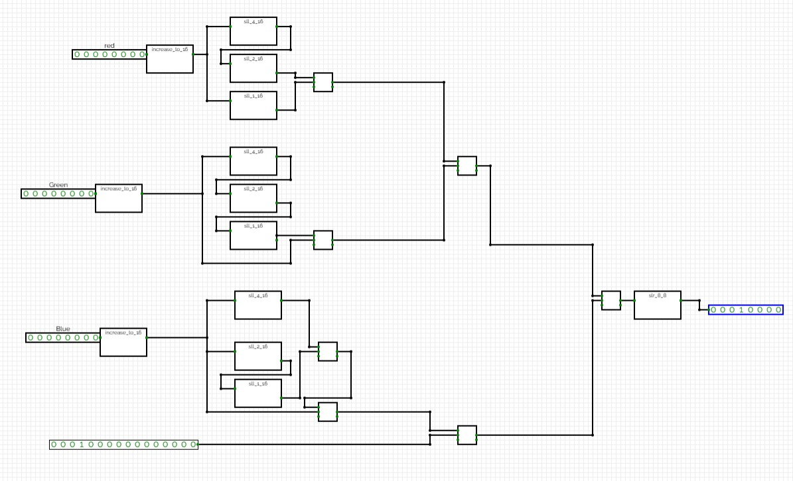

After loading the data, we should convert it to YUV. For this, we create a circuit that counts from 0 to 76799 and converts each data sample to YUV. The circuit used for this operation is shown in the picture.

Our formula for converting each component is as follows:

$$
Y = 0.257R + 0.504G + 0.098B + 16\\
U = (-0.148)R + (-0.291)G + 0.439B + 128\\
V = 0.439R + (-0.368)G + (-0.071)B + 128
$$

However, we know that **floating-point operations are difficult to implement in hardware**, so we use **scaling and bit shifting to obtain a hardware-friendly form**, resulting in:

$$
Y = (66R + 129G + 25B + 4096) \gg 8\\
U = (-38R - 74G + 112B + 32768) \gg 8\\
V = (112R - 94G - 18B + 32768) \gg 8
$$

> **NOTE:** Each coefficient is multiplied by 256, and after performing the operations, we shift the result by 8 bits (divide by 256).

When the start bit becomes 1, the counter resets to zero and the operation begins. After the counter reaches 76799, the conversion must stop. For this, we `AND` the start bit with a `done_bit`, so when the operation is completed, it sets the operation bit to zero, indicating that the conversion is finished. After this, it produces a signal named `DS_bit`, which starts the downsampling operation.

> **NOTE:** For multiplication, we decompose constants as follows:

$$
66R = (64 + 2)R = (R << 6) + (R << 1)
$$

So we implement it as:

$$
Y =
((R << 6) + (R << 1)) +
((G << 7) + G) +\\
((B << 4) + (B << 3) + B) +
4096
\gg 8
$$

$$
U =
-((R << 5) + (R << 1) + R) -\\
((G << 6) + (G << 3) + (G << 2) + G) +\\
((B << 6) + (B << 5) + (B << 4)) +
32768
\gg 8
$$

$$
V =
((R << 6) + (R << 5) + (R << 4)) -\\
((G << 6) + (G << 4) + (G << 3) + (G << 2) + (G << 1))\\
- ((B << 4) + (B << 1)) +
32768
\gg 8
$$

For example, for the `red conversion of Y`, we design a circuit like this:

- Main circuit  

- increase_to_16 function  

- shift by 4  

The full Y conversion circuit is shown below:  

now we connect Y & U & v conversion in the main circuit, we add connections to `RAM` and start and load bits for it.