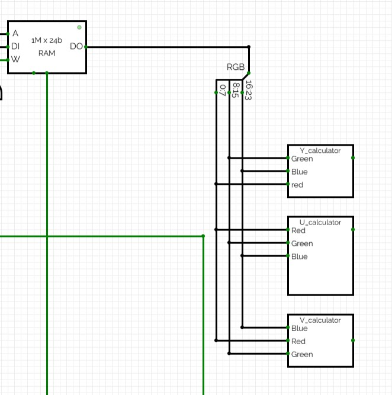
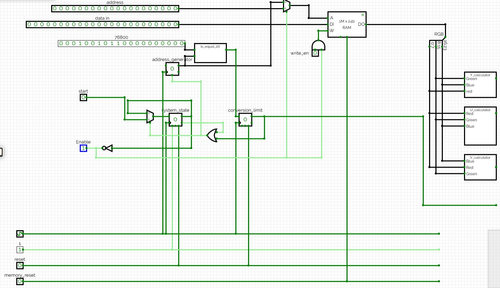

# RGB2YUV conversion RAM control

For controlling the conversion, we need a circuit. As mentioned in the conversion file, when the user sets the start bit to 1, our system should start reading pixels one by one from memory and convert them using the conversion functions. The conversion functions are implemented as shown below:

As you can see, we read an address from the memory (which is used as temporary storage for compressing the image). This address is in the range of `0` to `76800`. Therefore, we need a counter that counts within this range. However, it should not always count. When **the start bit is 1 and the system is not in the middle of a conversion**, it should reset and start counting.

**If the system is already in the middle of a conversion operation, it should continue the process and ignore the start bit.**

To achieve this, we use a flip-flop to store the state of the system. If its value is `1`, the system ignores new inputs and sets the enable signal (which indicates whether the system is ready for new input) to `0`.

Another important issue is the **RAM**. During the conversion process, the RAM should not **respond to external data inputs or address signals**. Therefore, we must include this control logic in our design. After applying these controls, we obtain the following circuit:

## Some information about the circuit:

- We use a `MUX` for the address input. The select signal of this MUX comes from the enable line. When no operation is in progress and enable is `1`, the user can access the `RAM` and store the image to be compressed in the temporary memory.

- The write enable signal is the `AND` of the user-controlled `write_en` signal and the enable line. This ensures that when the system is in the middle of a conversion, the user cannot write new data into memory.

- The `system state` flip-flop stores the current state of the system. When a conversion is in progress, its value is `1`, which forces the enable line to `0`. This prevents any access to memory or starting a new conversion. We also expose this enable signal as an output so the user knows when the system is ready for a new operation.

  The input of this flip-flop is driven by a `MUX` that selects between its previous value and the input control signal. While the system is processing, it keeps its state. Once the operation is complete, it allows starting a new conversion.

- The `conversion limit` flip-flop is used to synchronize the `system state` flip-flop with other components. This signal is used to control the `counter` and the `system state`. When the counter reaches `76800`, the conversion is complete, and the system becomes ready for a new operation.

  At this point, the input of the `system state` flip-flop is selected through the MUX. If the user does not request a new conversion, the system state becomes `0`, and all other components (such as `RAM` write access) are available to the user again.
