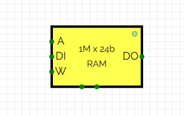
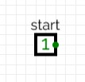

### RAM

For storing the compressed image, input image, and etc., we need one SRAM. This SRAM should store:

$$
\text{image} = (320 \times 24 0)\ \text{pixels} \\
= (320 \div 8)\times(240 \div 8)\ \text{blocks} \\
= 40 \times 30 = 1200\ \text{blocks}
$$

It means we have 1200 `8x8` blocks, so we have:
- `1200x64` address width  
- `8x8` bit width  

We will have these for each R, G, and B of the image. So we will have:
- `1200x8x8` (pixel number) address width  
- `3x8` (pixel value for RGB) bit width  

For temporary storage of the input image, our system should read this image, compress it, and store it in the storage section of RAM.

After downsampling, we have 1200 blocks for Y (brightness) and 600 blocks for each U and V chroma, so we have a total of 2400 blocks.  
After quantization and lossless coding, we cannot define a specific number of bits for each image.

So, we have `1200x8x8 = 76800` addresses for temporary storage. That means we need a minimum of `17` address bits for storing the input image. We do not need extra storage for compression, because we can rewrite this temporary storage for each block. In addition to this, we need storage for the compressed image. We set this storage to `20` address bits and control the space of RAM. If it becomes full, we show a full bit to the user and do not accept new data until the user frees up space.

Our data width will be `3x8 = 24` bits because we have 1 pixel in each location, and each pixel can range from 0 to 255 for Red, Green, and Blue. So we need 8 bits for each channel.

So, we have 20 address bits and 24-bit data width.  
We store data in addresses 0 to 76799 (`10010101111111111`).

*NOTE: We will read from the output of RAM for our image and perform the compression algorithm on it ([Project Description](#Project-Description) - Input RGB section).*

*NOTE: we should have one start bit, when the user add RGB to the RAM, it should rise start bit so our system understand it and start compressing algorithm on it*

